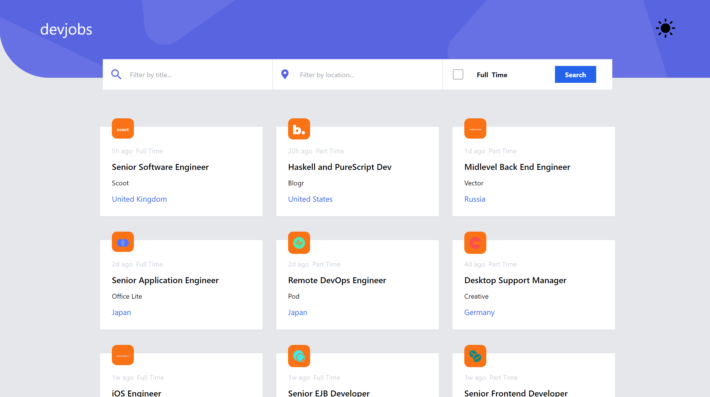
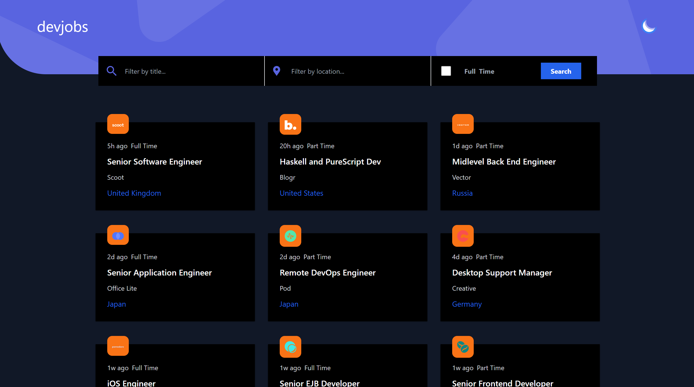

# Frontend Mentor - Devjobs web app solution

This is a solution to the [Devjobs web app challenge on Frontend Mentor](https://www.frontendmentor.io/challenges/devjobs-web-app-HuvC_LP4l). Frontend Mentor challenges help you improve your coding skills by building realistic projects.

## Table of contents

- [Overview](#overview)
  - [The challenge](#the-challenge)
  - [Screenshot](#screenshot)
  - [Links](#links)
- [My process](#my-process)
  - [Built with](#built-with)
  - [Useful resources](#useful-resources)
- [Author](#author)

## Overview

### The challenge

To build out a jobs board using the provided data, trying to get your project looking as close to the reference design as possible.

Users should be able to:

- View the optimal layout for each page depending on their device's screen size
- See hover states for all interactive elements throughout the site
- Be able to filter jobs on the index page by title, location, and whether a job is for a full-time position
- Be able to click a job from the index page so that they can read more information and apply for the job
- **Bonus**: Have the correct color scheme chosen for them based on their computer preferences. _Hint_: Research `prefers-color-scheme` in CSS.

### Screenshot

### Links

- [Live Site](https://fm-devjobs-web-app.vercel.app/)

## My process

### Built with

- Semantic HTML5 markup
- Tailwind
- Mobile-first workflow
- [React](https://reactjs.org/) - JS library

### Useful resources

- [React Router 6](https://youtu.be/nDGA3km5He4)
- [Creating a Multi-Filter Function to Filter Out](https://betterprogramming.pub/creating-a-multi-filter-function-to-filter-out-multiple-attributes-javascript-react-rails-5aad8e272142)
- [How to work with checkboxes in React](https://dev.to/collegewap/how-to-work-with-checkboxes-in-react-44bc)
- [Load more functionality in ReactJS](https://levelup.gitconnected.com/load-more-functionality-in-reactjs-82446862bc06)

## Author

- Website - [www.idoniyor.com](https://www.idoniyor.com)
- Frontend Mentor - [@aloxanovme](https://www.frontendmentor.io/profile/aloxanovme)
